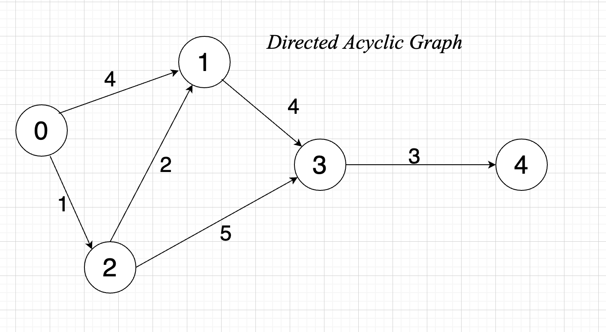
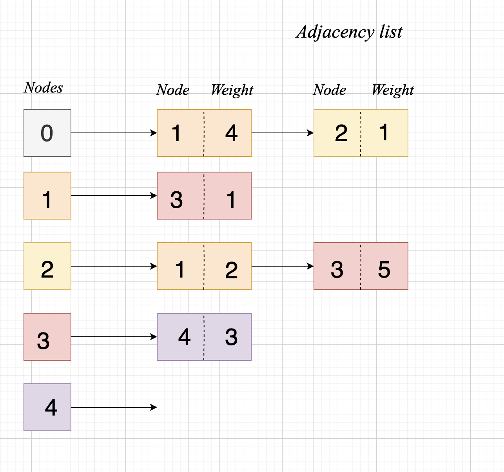

# dijkstra

Let's implement the Dijkstra Algorithm.

<https://www.geeksforgeeks.org/dijkstras-algorithm-for-adjacency-list-representation-greedy-algo-8/>

`Dist table: Example usecase`
|||||||
| :--- | :--- | :--- | :--- | :--- | :--- |
| Nodes| 0 | 1 | 2 | 3 | 4 |
| Distance from node | 0| 3| 1| 4| 7|

## Example Graph

## Adjacency list

