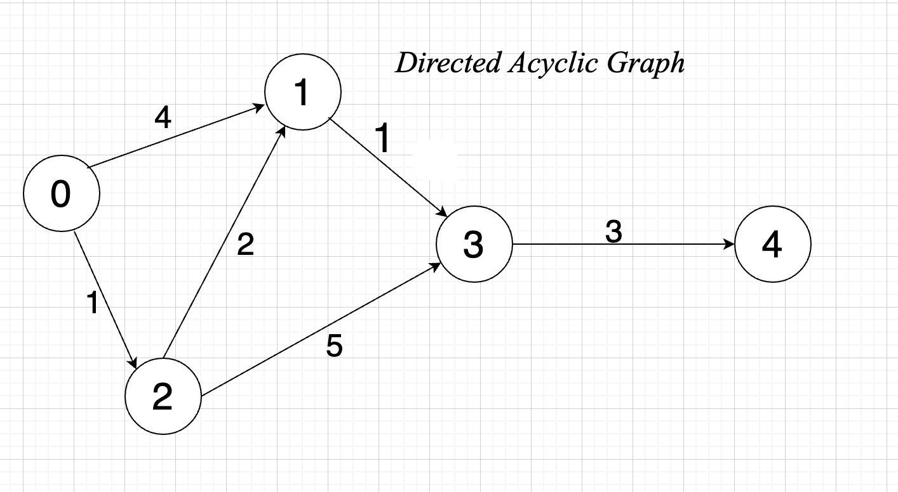
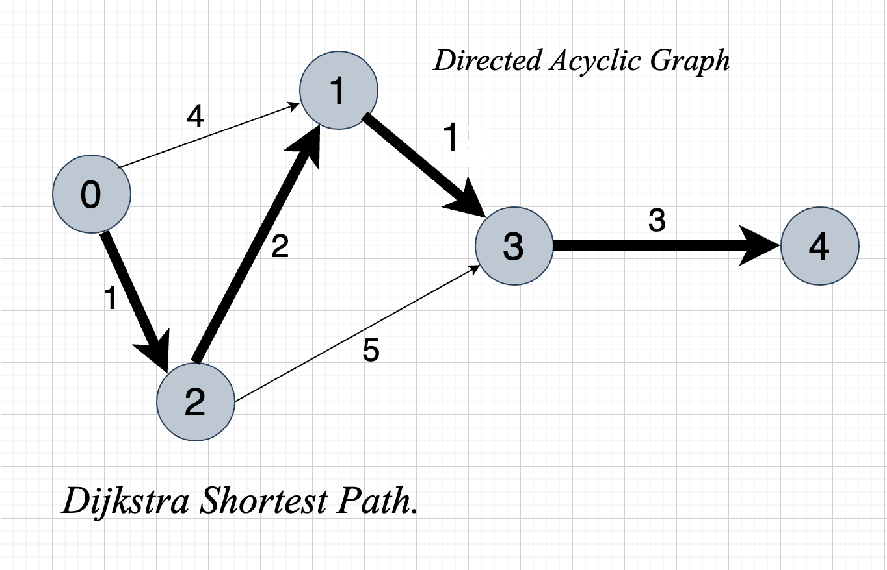

# dijkstra

Let's implement the Dijkstra Algorithm.

Inspired by this lesson: <https://www.youtube.com/watch?v=pSqmAO-m7Lk>

`Distance table: Example usecase`
|||||||
| :--- | :--- | :--- | :--- | :--- | :--- |
| Nodes/Vertices| 0 | 1 | 2 | 3 | 4 |
| Distance from node | 0| 3| 1| 4| 7|

## Example Weighted Graph



## Adjacency list


## Result of Dijkstra shortest path



## Result

```shell
dijkstra git:(master) go run main.go
Distance graph:  [0 3 1 4 7]
Shortest Path:  [2 1 3 4]
```
